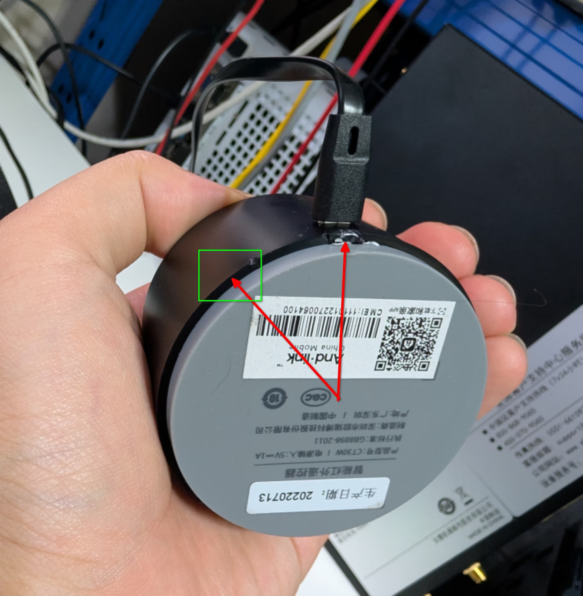
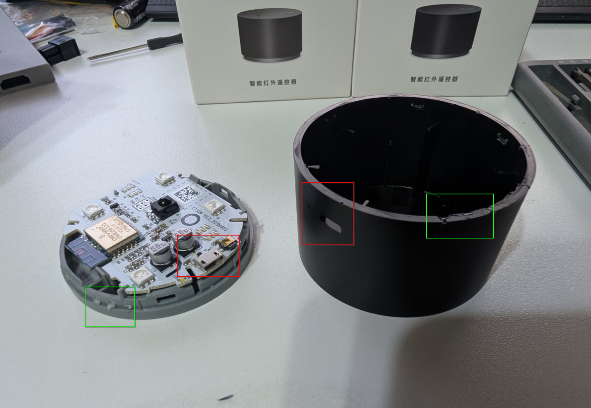
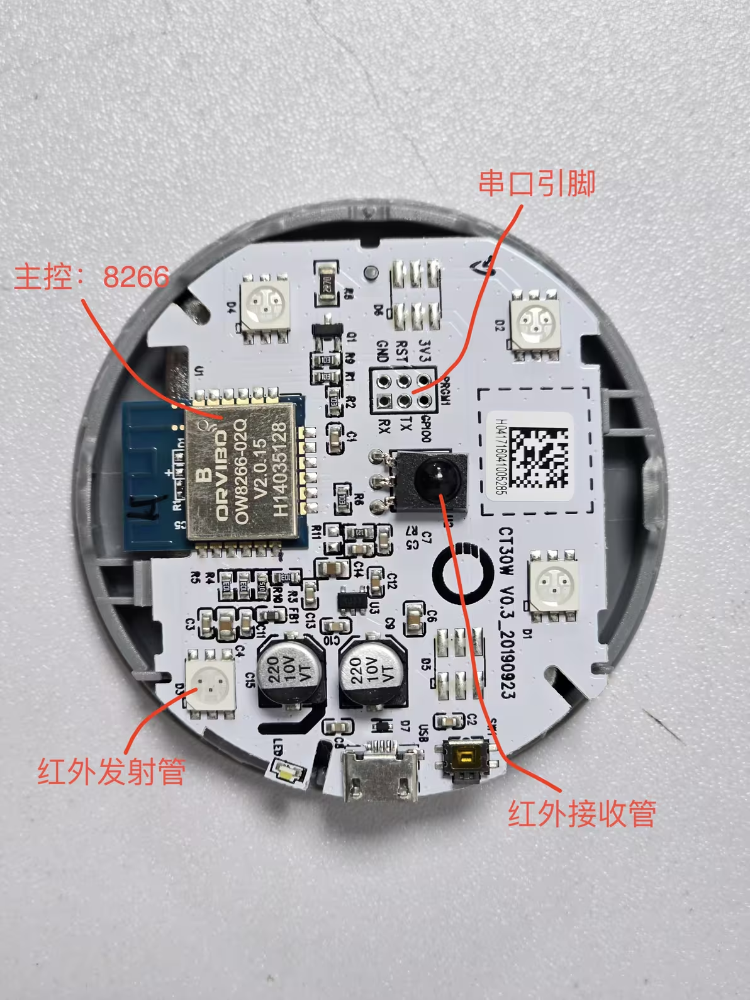
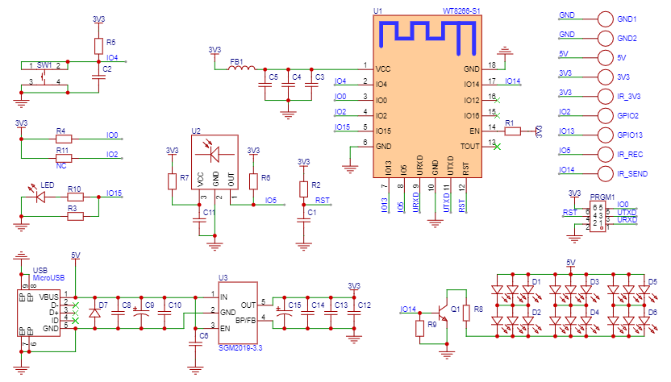
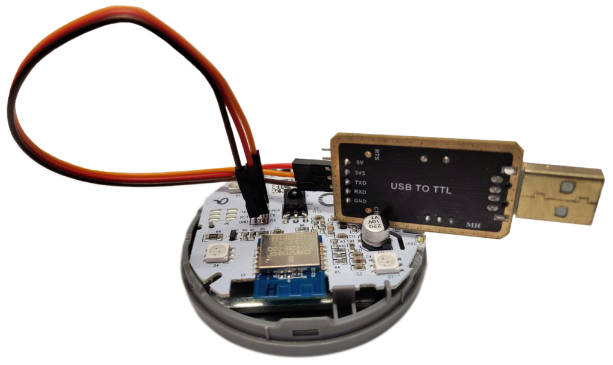
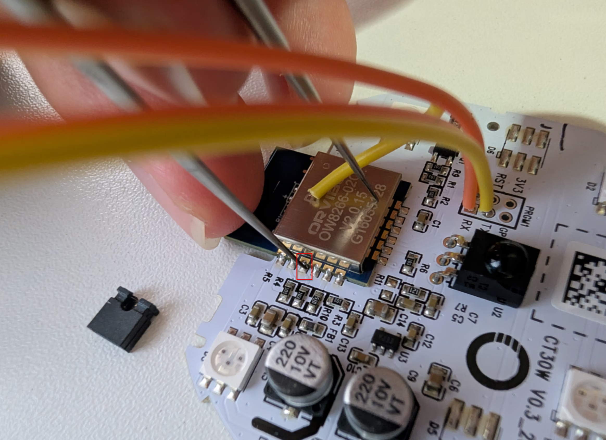

# 安装准备
## 硬件
1. **欧瑞博CT30W**
2. USB 转 TTL 工具
3. 五根杜邦线
4. 电烙铁

## 软件

在线烧录工具：
[ESPWebTool](https://esptool.spacehuhn.com/)
[Web - ESPHome](https://web.esphome.io/)

## 拆机

### 方案一
*亲测有效*
来源：[八块钱搞定远程开空调--欧瑞博CT30W折腾记 - cyberbus](https://cyberbus.net/post/599)
> 
> 如图，从底部usb接口两侧大概30度的位置翘
> 
> 红色是usb接口位置，绿色是翘的地方。这样把渣渣清理掉之后最终扣回去也几乎看不出来

### 方案二
来源：[Home Assistant | 基于ORVIBO CT30W的ESPHome空调红外遥控器 – CCBP的小站](https://www.amrzs.net/2024/11/17/orvibo_ct30w_esphome/)
> 底座和上盖是通过卡口连接的，并且因为底座没什么受力点所以想要无损拆开还是比较难的。为我尝试使用**热风枪**让上盖变软一些也许能尽可能少损伤的拆开，300℃吹上盖和底座的连接处 2 分钟左右，然后用小的一字螺丝刀撬开个缝隙后再用大的一字螺丝刀大力出奇迹即可将上盖和底座撬开，虽然无法做到完全无损，但除了螺丝刀的受力点有些变形外就没有损伤了。

### 主板介绍
来源：[仅8元！目前性价比最高的Home Assistant红外遥控器方案 - 哔哩哔哩](https://www.bilibili.com/opus/967982171394408465)

### 电路板
来源：[Home Assistant | 基于ORVIBO CT30W的ESPHome空调红外遥控器 – CCBP的小站](https://www.amrzs.net/2024/11/17/orvibo_ct30w_esphome/)

# 接线
**操作顺序：USB转TTL → 短接 → 接通电源 → 识别设备**
## 焊接杜邦线
**首次烧录需使用 USB 转 TTL 串口模块，令 ESP8266 进入刷机模式才行。**

1. 直接将杜邦线可以插进去，但是会出现接触不良的情况，焊接更可靠。接法：`TXD<->RX`、`RXD<->TX`、`GND<->GND`

|USB转TTL串口模块|ORVIBO CT30W|
|---|---|
|TXD|RX|
|RXD|TX|
|GND|GND|

2. 将USB转TTL串口模块连接到PC上（此时不要接通电源）

3. 将`GPIO0`在拉低情况下上电以进入刷机模式。

图片·来源：[Home Assistant | 基于ORVIBO CT30W的ESPHome空调红外遥控器 – CCBP的小站](https://www.amrzs.net/2024/11/17/orvibo_ct30w_esphome/)

## 短接方法
### 方案一
来源：[八块钱搞定远程开空调--欧瑞博CT30W折腾记 - cyberbus](https://cyberbus.net/post/599)
> ISP短接点（gpio0）是模块左边第三个点，用镊子短接到金属壳或者随便哪个GND

### 方案二
来源：[仅8元！目前性价比最高的Home Assistant红外遥控器方案 - 哔哩哔哩](https://www.bilibili.com/opus/967982171394408465)
> 拿根镊子，把TX引脚旁边的GPIO 0和GND短接，然后上电，进入刷机模式。另一种更简单的办法是，用一个尖尖的金属（表笔，螺丝刀都行），把芯片的第三根引脚（就是GPIO 0）和屏蔽罩短接起来，然后插电源开机。

### 自研方案
直接用两根杜邦线焊接GPIO 0和GND，需要短接时将公母头接上就好了，这个方法最稳定，最轻松，适合多次烧录。

[八块钱搞定远程开空调--欧瑞博CT30W折腾记 - cyberbus](https://cyberbus.net/post/599)
[八块钱搞定远程开空调：欧瑞博CT30W折腾记_哔哩哔哩_bilibili](https://www.bilibili.com/video/BV1eF8uzuECR/?vd_source=2cee40d94900c90d11bb8157cb9034c1)

[web1n/ORVIBO-CT30W: 欧瑞博 CT30W 红外遥控器](https://github.com/web1n/ORVIBO-CT30W)

[仅8元！目前性价比最高的Home Assistant红外遥控器方案 - 哔哩哔哩](https://www.bilibili.com/opus/967982171394408465)

[打造你自己的智能家居硬件，HomeAssistant+ESPHome方案介绍，智能家居DIY详细教程_哔哩哔哩_bilibili](https://www.bilibili.com/video/BV14ryhYHEJK/?spm_id_from=333.1391.0.0&vd_source=2cee40d94900c90d11bb8157cb9034c1)

[Home Assistant | 基于ORVIBO CT30W的ESPHome空调红外遥控器 – CCBP的小站](https://www.amrzs.net/2024/11/17/orvibo_ct30w_esphome/)

[CCBP/ORVIBO-CT30W-ESPHome: 基于 ORVIBO CT30W，通过修改固件的方式刷入 ESPHome，实现支持格力 Kelvinator 协议的红外遥控器，支持接入Home Assistant进行空调的远程控制。](https://github.com/CCBP/ORVIBO-CT30W-ESPHome)

